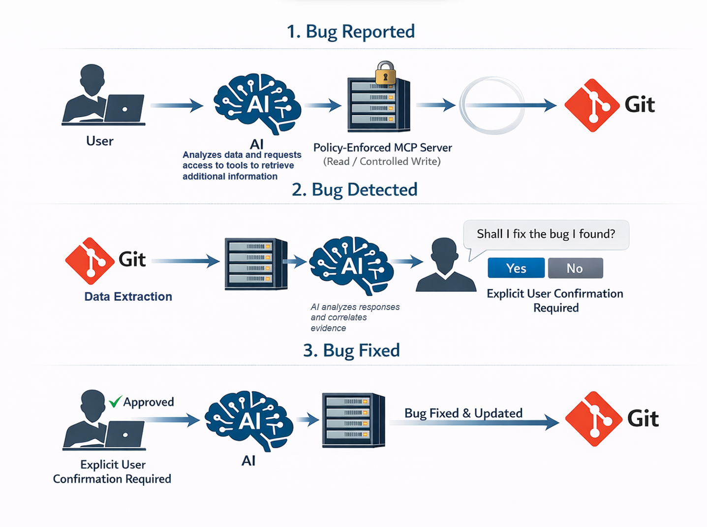
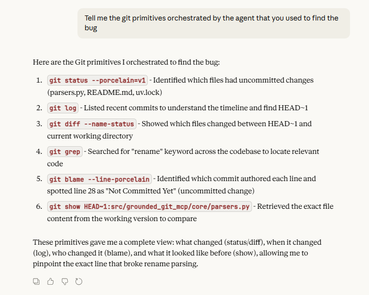
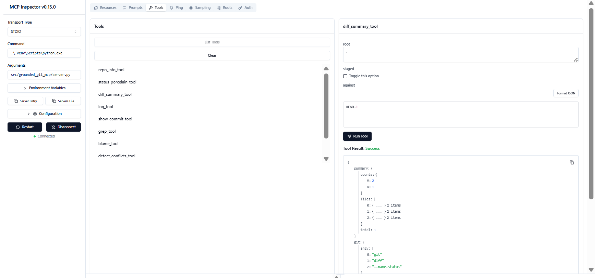

[](https://www.python.org/)
[](https://modelcontextprotocol.io/)
[](https://docs.pytest.org/)
[](#testing--ci)

# grounded-git-mcp  
### Local, Safe, Agent-Oriented Git Debugging & Code Exploration via MCP

**grounded-git-mcp** is a local, production-grade **MCP (Model Context Protocol) server** that provides AI agents with **secure, deeply contextual access** to Git repositories.

Because it runs **entirely locally**, the server always operates on the **exact, real state of the codebase** - including the working tree, uncommitted changes, and full Git history.  
This enables **precise, state-aware debugging and analysis** without relying on stale snapshots or remote APIs.

The system is designed with a **safety-first execution model**:  
AI agents may *analyze*, *reason*, and *propose* Git commands - but **never execute write operations automatically**.

---


## At a glance

- 🔍 Full access to **Git time + local state**
- 🛡️ **Human-in-the-loop** execution with explicit approval
- ⏳ Support for **deferred / delayed execution**
- 🚫 No GitHub API, no network access, fully local
- 🧪 Covered by unit, integration, and snapshot tests

---

## How this MCP enables powerful debugging

The core strength of `grounded-git-mcp` is that it exposes **both time and state** to AI agents.

- **Time** -complete Git history: commits, diffs, blame, and file content at any reference  
- **State** - the current local working tree: staged, unstaged, and uncommitted changes

This allows agents to answer questions such as:

- *When did this behavior change?*
- *Which exact lines introduced the regression?*
- *What was the last known-good implementation?*
- *What changed between then and now?*

All conclusions are derived from **direct Git evidence**, not assumptions.




---

## Example: Real-world debugging with Claude

**User prompt sent to the AI agent:**

> *Rename parsing worked in HEAD~1 but is broken now.  
> Use Git history, diff, and blame to find what changed and suggest the safest fix.*

Using `grounded-git-mcp`, the agent was able to:

1. Inspect the current working tree
2. Compare `HEAD` with `HEAD~1`
3. Identify the exact files and lines that changed
4. Trace authorship and intent using `git blame`
5. Explain **why** the regression occurred
6. Propose a **minimal, safe fix** - without executing anything

### Visual example


---

## Beyond debugging: Code exploration & analysis

`grounded-git-mcp` is built for more than bug fixing.

By combining **current local state** with **full Git history**, AI agents can:

- Explore repository structure and architecture
- Trace how logic evolved over time
- Compare alternative implementations
- Assess real system impact via diffs
- Understand ownership and intent via blame

### Engineering use cases

- Onboarding to large or unfamiliar codebases  
- Refactoring and technical debt analysis  
- Regression and root-cause investigations  
- Design and architectural reviews  

The result is **continuous, engineering-grade context** - not isolated snapshots.

---

## Safe Git automation with explicit approval

All Git operations are governed by a strict safety model.

### Execution model

Git commands are classified by **risk level**:

#### Low risk - Read-only
- Non-mutating commands execute immediately
- No approval required
- Enables fast inspection and analysis

#### Medium risk - Write operations
- Never executed automatically
- The agent **proposes** a command
- The server returns:
  - a one-time confirmation token
  - enforced safety preconditions (HEAD state, conflicts, etc.)
- Execution occurs **only after explicit user confirmation**

✅ **Audit & traceability:**  
Every operation that requires explicit approval is **automatically audited**.  
After execution, the user can review a durable record of what was proposed, approved, executed, and the resulting output — ensuring full transparency, accountability, and post-hoc validation.


#### Critical risk - Manual only
- Never executed by the server
- The agent explains what to run
- The user executes commands manually

### Deferred execution

Approved write operations may be executed **at a later time**, providing full control over *when* changes are applied.

This design balances **automation, safety, and human control**, making the system suitable for production environments.

---

## Available MCP tools

|  | Tool | Description |
|--|------|-------------|
| 📦 | `repo_info_tool` | Repository metadata and high-level context |
| 📄 | `status_porcelain_tool` | Working tree status |
| 🔍 | `diff_summary_tool` | Summarized diff information |
| 🕒 | `log_tool` | Commit history traversal |
| 🧩 | `show_commit_tool` | Commit details and patches |
| 🔎 | `grep_tool` | Repository search |
| 👤 | `blame_tool` | Line-level attribution |
| ⚠️ | `detect_conflicts_tool` | Merge and conflict detection |
| 🛡️ | `propose_git_command_tool` | Propose write operations with approval flow |
| ✅ | `execute_confirmed_tool` | Execute explicitly approved commands only |

---
> **Note:**  
> MCP tool **and resource** definitions in `server.py` intentionally include detailed, LLM-oriented descriptions.  
> These descriptions are part of the AI-facing contract and are designed to guide correct selection, safe usage, and optimal agent behavior.


## Available MCP resources (read-only)

|  | Resource | Description |
|--|----------|-------------|
| 🌳 | `repo://{root}/{ref}/tree` | Repository tree at a Git reference |
| 📄 | `repo://{root}/{ref}/file/{path}` | File content at an exact reference |
| 🔀 | `repo://{root}/diff?base={base}&head={head}` | Diff between two references |

---

## Project structure

```text
src/grounded_git_mcp/
├── server.py        # MCP server entrypoint
├── core/            # Safe Git runner, policies, limits, schemas
├── tools/           # MCP tools + approval flow
├── resources/       # Read-only repo resources
└── tests/           # unit, integration, snapshot tests
```

---

## Installation

### Prerequisites
- Python **3.11+**
- Git available on `PATH`

### Install (editable)

```bash
python -m venv .venv
source .venv/bin/activate        # Windows: .venv\Scripts\activate
pip install -e .
```

---

## Running the MCP server

```bash
python -m grounded_git_mcp.server
```

By default, the server operates on the **current working directory** as the Git root.

---

## Example: Claude Desktop configuration

```json
{
  "mcpServers": {
    "grounded-git-mcp": {
      "command": "uv",
      "args": [
        "run",
        "--directory",
        "C:\\path\\to\\TARGET_REPOSITORY",
        "python",
        "-m",
        "grounded_git_mcp.server"
      ]
    }
  }
}
```

The `--directory` argument defines the **target Git repository** the server operates on.  
The MCP server itself does not need to reside inside that repository.

---
## MCP Inspector: live protocol validation
The server was validated end-to-end using the official **MCP Inspector**.

All tools and resources executed successfully, confirming protocol compliance, schema stability, and a fully working integration.


## Testing & CI

The project is protected by a comprehensive testing strategy:

- **Unit tests** for core logic and edge cases  
- **Integration tests** for end-to-end MCP → Git flows  
- **Snapshot tests** to guarantee protocol and schema stability  

A **GitHub Actions CI pipeline** runs on every push and pull request.

```bash
pytest -q
```

All safety guarantees are continuously enforced under CI.

---

## 🔮 Future Work

- 🤖 **Multi-Agent Tool Comparison** — Evaluate multiple AI tools or agents per request and recommend the optimal one based on accuracy, safety, and context fit.
- 🧠 **Context-Aware Execution Policies** — Dynamically adjust approval rules and risk classification based on repository state and historical behavior.
- 🌐 **Cross-Repo Context Linking** — Enable analysis across multiple local repositories to trace changes, dependencies, and shared logic.
